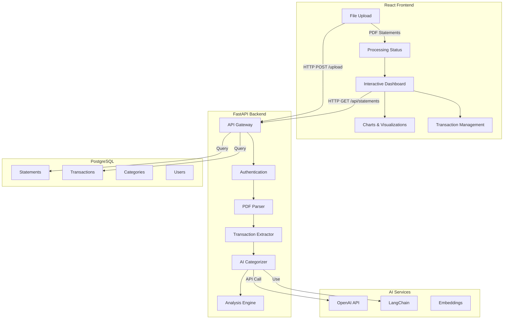

# SentidoFinanciero - AI-Powered Bank Statement Analyzer

A full-stack application that uses OpenAI's GPT models through LangChain to automatically categorize and analyze Mexican bank statement transactions. Upload PDF statements and get intelligent insights about your spending patterns with full Spanish language support and a complete dark mode experience.

## Application Screenshots


### Light Theme

<table>
<tr>
<td width="25%">


</td>
<td width="25%">


</td>
<td width="25%">


</td>
<td width="25%">


</td>
</tr>
</table>

### Dark Theme

<table>
<tr>
<td width="33%">


</td>
<td width="33%">


</td>
<td width="33%">


</td>
</tr>
</table>


## Features in Detail

### Smart Categorization

* **Hybrid Approach**: Combines rules-based and ML-based categorization
* **Mexican Bank Support**: Optimized for BBVA, Santander, and other Mexican banks
* **CONDUSEF Format**: Supports universal bank statement format (October 2024+)
* **Multi-language Support**: Full Spanish interface with Mexican financial terminology
* **Intelligent Recognition**: Understands Mexican merchant names and transaction patterns

### Data Visualization

* **Interactive Charts**: Built with Chart.js
* **Custom Reports**: Generate and export detailed reports
* **Spending Trends**: Track expenses over time

### Security & Privacy

* **End-to-End Encryption**: All data encrypted in transit and at rest
* **Data Minimization**: Only processes necessary transaction data
* **GDPR Compliant**: Built with privacy in mind


## Architecture



## Quick Start

### Prerequisites

1. **OpenAI API Key**: Get your API key from [OpenAI Platform](https://platform.openai.com/api-keys)
2. **Docker & Docker Compose**: For containerized deployment

### Option 1: Docker Development (Recommended)

```bash
git clone <repository-url>
cd statement-sense

# Copy environment file and add your OpenAI API key
cp example.env .env
# Edit .env and add your OPENAI_API_KEY

# Start development environment
make docker-dev
# OR
docker-compose up --build
```

### Option 2: Local Development

```bash
# Copy environment file
cp example.env .env
# Edit .env with your OpenAI API key and local settings

# Backend setup
python -m venv .venv
source .venv/bin/activate  # On Windows: .venv\Scripts\activate
pip install uv
uv pip install -e ".[dev]"

# Start local database
docker-compose up postgres

# Run backend
make run
# OR
uvicorn app.main:app --reload

# Frontend setup (in another terminal)
cd frontend
npm install
npm run dev
```

### Option 3: One-Command Setup

```bash
git clone <repository-url>
cd statement-sense
# Edit example.env with your OpenAI API key, then:
cp example.env .env
./setup.sh
```

## Configuration

### Environment Variables

#### Required

```env
# OpenAI Configuration
OPENAI_API_KEY=your-openai-api-key-here
OPENAI_MODEL=gpt-3.5-turbo  # or gpt-4 for better accuracy

# Database Configuration
DB_HOST=postgres  # Use 'localhost' for local dev
DB_PORT=5432
DB_USER=statement_user
DB_PASS=statement_password
DB_NAME=statement_sense

# Security
SECRET_KEY=your-secret-key-here
```

#### Optional

```env
# OpenAI Fine-tuning
OPENAI_MAX_TOKENS=150
OPENAI_TEMPERATURE=0.1

# Application Settings
PROJECT_NAME=SentidoFinanciero
LOG_LEVEL=INFO
DEBUG=true
UPLOAD_DIR=./uploads
MAX_FILE_SIZE=50MB

# CORS
BACKEND_CORS_ORIGINS=http://localhost:3000
```

### Model Selection

* **GPT-3.5-turbo**: Fast and cost-effective, good for most use cases
* **GPT-4**: Higher accuracy for complex transactions, more expensive

Update your `.env` file:

```env
OPENAI_MODEL=gpt-4  # For maximum accuracy
# OR
OPENAI_MODEL=gpt-3.5-turbo  # For cost efficiency
```

## Usage Guide

### 1. Upload Statement

1. Navigate to **Subir Estado** (Upload Statement) page
2. Drag & drop PDF file or click **Seleccionar Archivos** to browse
3. Supports CONDUSEF universal format (since October 2024)
4. Maximum file size: 50MB per file
5. Wait for upload confirmation
6. Click **Procesar** to analyze with AI

### 2. View Dashboard

1. Access the main **Dashboard** for overview metrics
2. View total statements, transactions, and amounts processed
3. Search and filter statements by name or bank
4. Click on any statement to view detailed analysis

### 3. Analyze Statements

1. Select a processed statement from the dashboard
2. Explore two main tabs:
   * **Análisis**: Interactive charts showing spending distribution by category
   * **Transacciones**: Complete transaction list with AI-generated categories
3. View detailed breakdowns including:
   * Balance Neto (Net Balance)
   * Total Ingresos (Total Income)
   * Total Gastos (Total Expenses)
   * Spending by category with visual charts

### 4. Manage Categories

1. Review AI-suggested categories in the transaction list
2. Categories include: Alimentación, Transporte, Salud, Ropa, etc.
3. All categorization is automatic using hybrid AI approach
4. Export functionality available for external analysis

### 5. Theme Customization

1. **Dark Mode Toggle**: Click the sun/moon icon in the navbar for instant theme switching
2. **System Preference**: Select "System" mode to automatically follow your OS theme setting
3. **Persistent Settings**: Your theme choice is saved and restored across sessions
4. **Complete Coverage**: All components, charts, and interactions properly themed
5. **Professional Design**: High contrast and accessibility-compliant color schemes

## AI Categorization

### How It Works: 3-Tier Enhanced Classification System

```python
# Tier 1: Exact Keyword Matching (Fastest)
"OXXO ROMA" → "alimentacion" (Confidence: 1.0)

# Tier 2: Pattern Recognition (Fast + Smart)
"REST BRAVA" → regex: r'\brest\b' → "alimentacion" (Confidence: 0.8)

# Tier 3: OpenAI GPT Analysis (Smart + Context-Aware)
"POINTMP*VONDYMEXICO" → GPT → "servicios" (Confidence: 0.9)
```

### Performance & Cost Optimization
* **85%** of transactions classified by Tiers 1-2 (< 1ms, $0 cost)
* **15%** require GPT analysis (~500-1500ms, ~$0.001-0.003 per transaction)
* **Intelligent Batching**: Groups similar transactions to reduce API calls
* **Context Awareness**: GPT understands Mexican merchant names and contexts

### Supported Categories
* **Alimentación** - Restaurants, groceries, convenience stores
* **Gasolineras** - Gas stations, fuel
* **Servicios** - Utilities, subscriptions, streaming
* **Salud** - Healthcare, pharmacies, medical
* **Transporte** - Uber, taxi, parking, public transport
* **Entretenimiento** - Movies, bars, entertainment
* **Ropa** - Clothing, fashion, department stores
* **Educación** - Schools, books, courses
* **Transferencias** - Bank transfers, payments
* **Seguros** - Insurance, policies
* **Intereses/Comisiones** - Bank fees, interest
* **Otros** - Miscellaneous

## API Documentation

### Core Endpoints

#### Statements
* `POST /api/v1/statements/upload` - Upload PDF file
* `GET /api/v1/statements` - List all statements
* `GET /api/v1/statements/{id}` - Get statement details
* `POST /api/v1/statements/{id}/process` - Process statement with AI
* `DELETE /api/v1/statements/{id}` - Delete statement

#### Transactions
* `GET /api/v1/statements/{id}/transactions` - Get transactions
* `PUT /api/v1/transactions/{id}` - Update transaction
* `DELETE /api/v1/transactions/{id}` - Delete transaction

#### Analysis
* `GET /api/v1/statements/{id}/analysis` - Get AI-powered spending analysis

### Example Request
```bash
# Upload a statement
curl -X POST "http://localhost:8000/api/v1/statements/upload" \
     -F "file=@statement.pdf"

# Get AI analysis
curl "http://localhost:8000/api/v1/statements/{id}/analysis"
```

Full API documentation available at: `http://localhost:8000/docs`

## Development

### Project Structure
```
statement-sense/
├── app/                    # FastAPI Backend
│   ├── api/               # API routes
│   ├── models/            # Database models
│   ├── schemas/           # Pydantic schemas
│   ├── services/          # Business logic
│   │   ├── pdf_parser.py  # Enhanced PDF processing
│   │   ├── mexican_parser.py # Mexican bank statement parser
│   │   ├── ocr_table_parser.py # OCR table extraction
│   │   └── smart_categorizer.py # OpenAI + LangChain categorization
│   └── main.py           # FastAPI app
├── frontend/              # React Frontend (SentidoFinanciero)
│   ├── src/
│   │   ├── components/    # UI components
│   │   ├── pages/         # Page components
│   │   ├── hooks/         # Custom hooks
│   │   ├── services/      # API services
│   │   └── utils/         # Utilities
│   └── package.json
├── docs/                  # Documentation and screenshots
├── migrations/            # Database migrations
├── docker-compose.yml     # Docker services
└── README.md
```

### Adding New Features

#### Backend
1. Add model in `app/models/`
2. Create schema in `app/schemas/`
3. Add API endpoint in `app/api/`
4. Generate migration: `alembic revision --autogenerate`

#### Frontend
1. Create component in `src/components/`
2. Add route in `src/App.jsx`
3. Create API service in `src/services/`
4. Add hook in `src/hooks/`

### Running Tests
```bash
# Backend tests
pytest

# Frontend tests
cd frontend
npm test

# E2E tests
npm run test:e2e
```

## Docker Services

| Service | Port | Description |
|---------|------|-------------|
| Frontend | 3000 | React development server |
| Backend | 8000 | FastAPI application |
| Database | 5432 | PostgreSQL database |

### Docker Commands
```bash
# Start all services
docker-compose up -d

# View logs
docker-compose logs -f [service-name]

# Restart service
docker-compose restart [service-name]

# Stop all services
docker-compose down

# Rebuild and start
docker-compose up --build
```

## Cost Considerations

### OpenAI API Costs (Estimated)

**GPT-3.5-turbo:**
* Input: $0.0005 / 1K tokens
* Output: $0.0015 / 1K tokens
* **~$0.001-0.003 per complex transaction**

**GPT-4:**
* Input: $0.01 / 1K tokens
* Output: $0.03 / 1K tokens
* **~$0.01-0.03 per complex transaction**

### Cost Optimization Tips
1. **Use GPT-3.5-turbo** for most use cases (good accuracy, lower cost)
2. **Hybrid approach** reduces API calls by 85%
3. **Batch processing** for multiple statements
4. **Set monthly limits** in OpenAI dashboard

**Example Monthly Cost:**
* 500 transactions/month
* 15% require AI (75 transactions)
* GPT-3.5-turbo: ~$0.08-0.23/month
* GPT-4: ~$0.75-2.25/month

## Troubleshooting

### Common Issues

#### OpenAI API Errors
* **Invalid API Key**: Check your `.env` file and OpenAI dashboard
* **Rate Limits**: Upgrade your OpenAI plan or implement retry logic
* **Insufficient Credits**: Add billing information to your OpenAI account

#### Upload Fails
* Check file is PDF format
* Ensure file size < 50MB
* Verify backend is running

#### Processing Stuck
* Check OpenAI API status
* Verify API key permissions
* Check backend logs for errors

#### Database Errors
* Check PostgreSQL is running
* Run migrations: `alembic upgrade head`
* Reset database: `python init_db.py`

### Logs and Debugging
```bash
# View all logs
docker-compose logs -f

# Backend logs only
docker-compose logs -f backend

# Check OpenAI API usage
curl -H "Authorization: Bearer $OPENAI_API_KEY" \
     https://api.openai.com/v1/usage
```

## Production Deployment

### Environment Setup
1. Use production OpenAI API key with proper limits
2. Set secure environment variables
3. Enable HTTPS
4. Configure proper CORS settings
5. Set up monitoring and logging
6. Implement rate limiting

### Docker Production
```bash
# Production compose file
docker-compose -f docker-compose.prod.yml up -d
```

## Contributing

We welcome contributions!

1. Fork the repository
2. Create your feature branch (`git checkout -b feature/AmazingFeature`)
3. Commit your changes (`git commit -m 'Add some AmazingFeature'`)
4. Push to the branch (`git push origin feature/AmazingFeature`)
5. Open a Pull Request


## Acknowledgments

* **OpenAI** - GPT models for intelligent categorization
* **LangChain** - Simplified LLM integration framework
* **FastAPI** - Modern Python web framework
* **React** - Frontend framework
* **Tailwind CSS** - Utility-first CSS
* **Chart.js** - Data visualization
* **PostgreSQL** - Database system

## Support

* **Issues**: Report bugs via GitHub Issues

